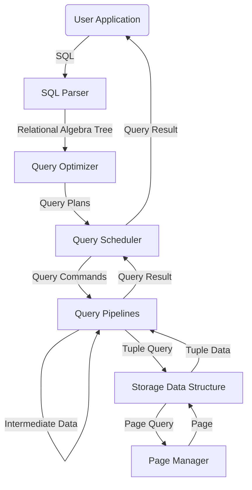
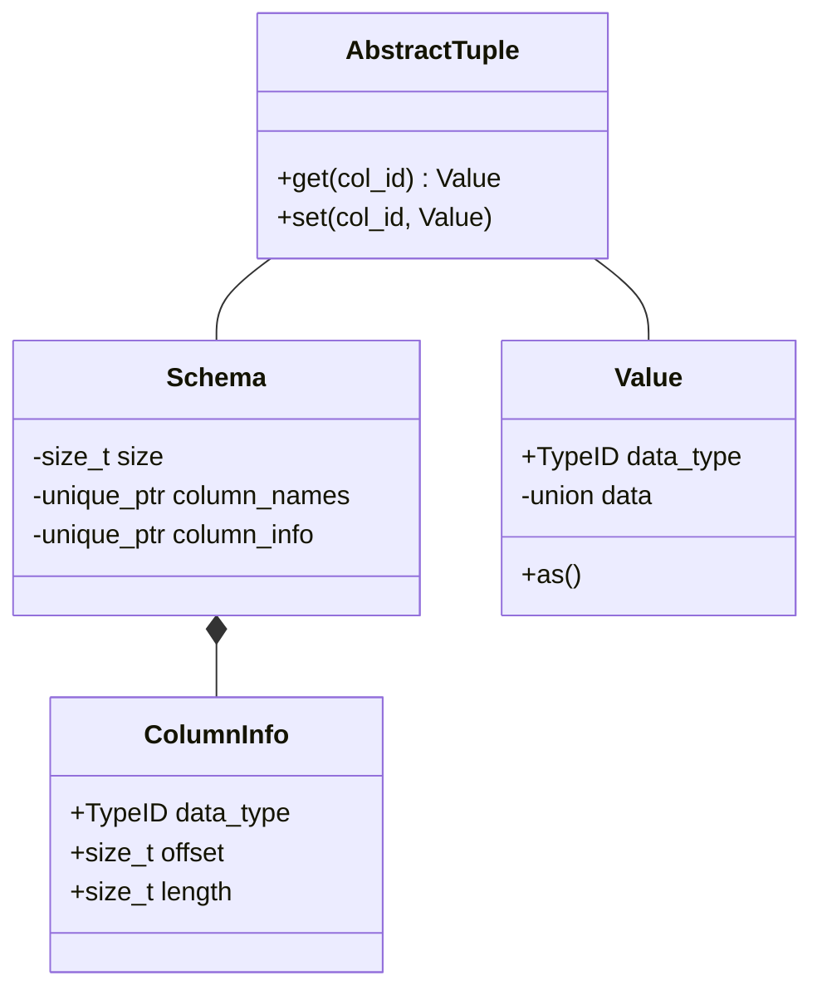
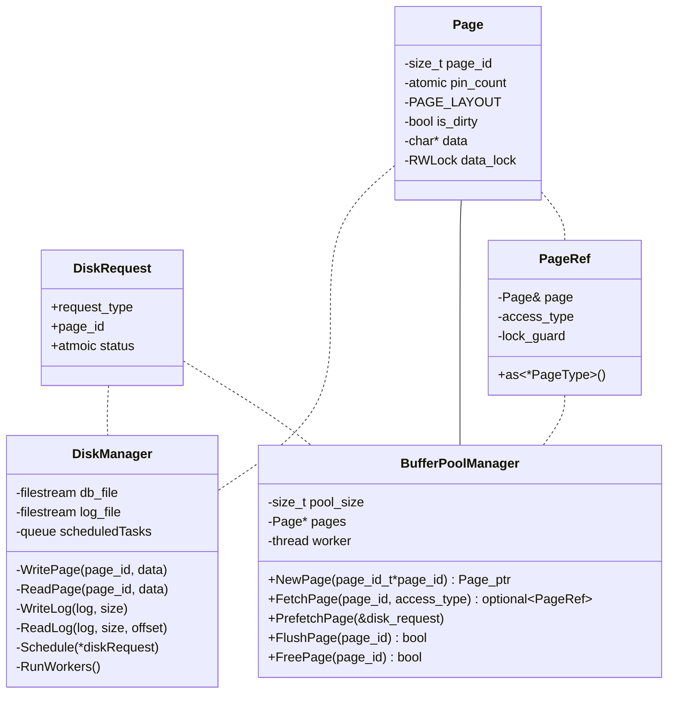
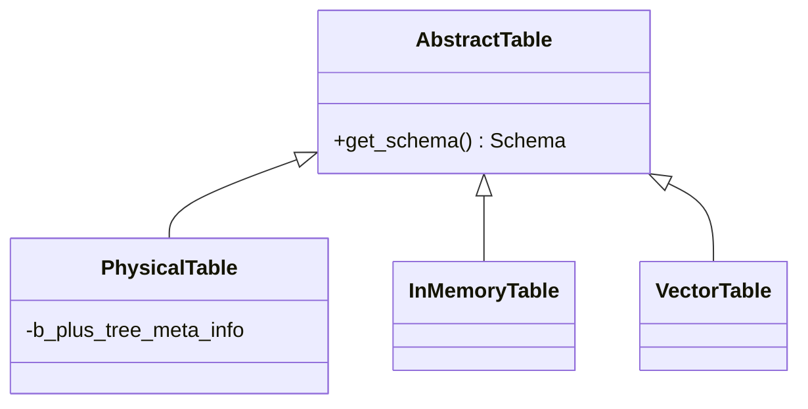

# roastdb

## Prerequisites

[CMU 15-445/645](https://15445.courses.cs.cmu.edu/spring2023/)

**Modern cpp**: ownership, RAII, concurrent programming, template

## Overview

### Major Choices

N-ary
Concurrency: Pessimistic
B-Plus Tree

### Architecture & Data Flow

### Main Modules

SQL Parser, Optimizer
Data handlers (Scheduler, Projector, Joiner, Scanner, Modifier)
Storage manager (hashmap + mvcc)
Page manager

## Storage Model

This part will be described in a bottom-top way.

### Basic Value Types

- `INT(8|16|32|64)`
- `FLOAT(32|64)`
- `TIMESTAMP`
- `CHAR(FIXED_LEN)|VARCHAR(MAX_LEN)`
- for `VARCHAR`, we store them in external storage and put their hash values and references in the table to ensure all data have fixed length.
- `BLOB` or `FILE_POINTER`

### Storage Models

> N-Ary Storage Model (NSM)

Store a tuple in the original form.

Advantages
- Fast insert, update and delete
- Good for queries which requires a lot of data

Disadvantages
- Too heavy for scanning in analystic queries

> Decompostion Storage Model

Store attributes sperately.

### Data Structure

> Hash Table

### Functionalities

Depending on whether primary key is the condition.

- Locate and Retrieve/Modify
- Sequential Scan and Retrieve/Modify

### Operation Failure Undo

> Multi-Version Concurrency Control

## SQL Handler

### Parser

The parser reads SQL queries and outputs relational algebra tree.

### Optimizer

Optimizer reduces the cost of queries.

## Data Handlers

### Processing Model

> Iterator Model
> Vectorization Model

### Data Fetchers

- Search `locate` or `scan`
- Return `data` or `tuple_id`

### Data Modifiers

### Joiner

- `Inner` or `Outer`

### Materializer

- Turn `tuple_id` to `data`

### Projector
        
### Aggregator

### Pipeline

## Concurrency Designs

### Versioning

Transactions have timestamps, which mark the order between transaction.

### Persistent Data Structure

> Persistent B-Plus Tree, core concept - **Copy on Write**
> :-1: Leaf-scans are very common, but persistent BPT cannot do this.

### Locks

#### Lock Types

> Transaction Lock

- Used to ensure the order and atmoicity of transactions. 
- Each table has a lock queue.

Suppose there are 3 transactions `T1(R(A),W(A))`, `T2(R(A),W(B),W(A))`, `T3(R(B),W(A))`. Note that the operations in one transaction can be inter-dependent, but are always in the form of DAG.

The lock queue of the two tables looks like

qA `T1(R),T1(W),T2(R),T2(W),T3(W)` qB `T2(W),T3(R)`

The head of qB `B(T2(W))` will wait for `A(T2(R))` in `T2`, while other head operations that are ready will be launched immediately. In this way, former operation will always run prior to the latter, thus order and atmoicity of transactions are protected.

When the operation is launched, the corresponding lock is freed and the data being operated is locked.

> Data Lock

- Data locks are solely used for data and data structure integrity.

A `W` intention lock is freed as soon as the operation is lauched, and then the following `R` operation may also be launched in no time. Under this circumstance, `R` will be stalled when it reads the data that will be modified by `W`, but for other untouched data, it can run in parallel with `W`.

#### Lock Hierarchy

> Table
> Page
> Tuple

### Thread Pool

workers: specialized or versatile

## Class Diagrams

### Basic Stuffs

`Schema` shares the same lifecycle with its corresponding table.

`TupleRef`, (actually `TableType::TupleRef` because different types of table have different way to access data) only points to a tuple which already exists in memory. It is a versatile utility to provide access to column item.

`TempAnyValue` is an any-type temporary data container used for calculation in sql expressions.

### Buffer and Pages

`DiskManager` manages direct disk operations. It holds several worker threads to process `DiskRequest` in parallel, which can accelerate disk reads because the OS can read different parts of one file at the same time.

`BufferPoolManager` manages the buffer pool.

`PageRef` is a reference to page in memory with automatic R/W lock_guard and pin management.

### Tabels

`Physical Table` manages a table that exists on disk, which can be accessed by executors like `seq_scan` and `update`.

`VectorTable` is the intermediate data format transmitted between executors in our vectorized model.

`InMemoryTable` is also an intermediate data format, used for nested queries. It distinguishes from `VectorTable` by having primary keys as index, while the other uses raw integers as index (which is not required to be ordered).

### Binder, Planner and Optimizer

### Workers, Tasks and Pipelines

## Query & Operations

> :+1::+1::+1::+1::+1: - dch

### Query We Support

#### Create
- Create a table: `create table t1(v1 int, v2 varchar(128), v3 int);`

#### Select
- Vanilla Select: `select * from t1`. `select v1 from t1`
- Select with arithmetics: `select v1 + v3 from t1`

#### Rename
`select v1 as b1 from t1`

#### Distinct
`select distinct v1 from t1`

#### Insert
- Vanilla Insert: `insert into t1 values (1, 'roastdb', 2), (1, 'bestdb', 2)`
- Insert with projection: `insert into t2 select v1+233, v2, v3+v1 from t1`
- Insert with condition: `insert into t2 select * from t1 where v2 = 'roastdb'`

#### Update
- Vanilla Update: `update t1 set v3 = 114 where v1 >= 514 and v2 = 'ahhh';`
- Update with arithmetics: `update t1 set v3 = v3 + v1;`

#### Delete
- Vanilla Delete: `delete from t1 where v1 >= 3`
- Delete Everything: `delete from t1;`

#### Create Index
`Create Index`

#### Aggregation
- Simple functions: `count()`, `min()`, `max()`, `sum()`, `avg()`
- Agg with distinct: `count(distinct v1)`
- Group by: `select v4, min(v1) + sum(v2) + max(v3), count(*) from t1 group by v4;`
- Having Clause: `select v4, min(v1) + sum(v2) + max(v3), count(*) from t1 group by v4 having avg(v2) > 2;`

#### Joining
- Inner join with condition: `select * from seq_1 s1 left join seq_2 s2 on s1.col1 + 5 = s2.col1;`
- Outer join, left & right join
- Multi-way join: `select * from (t1 a inner join t1 b on a.v1 = b.v1) inner join t1 c on a.v1 = c.v1;`

#### Sort
- Ascending Sort: `select v1, v2 from t1 order by v3 asc`
- Decending Sort: `select v1, v2 from t1 order by v3 desc`

#### Limit
- Vanilla Limit: `select * t1 limit 15;`
- Sort & Limit: `select v1 from t1 order by v3 limit 15`

#### Window Function
`select <function> over (partition by <something> order by <something>)from t1`

